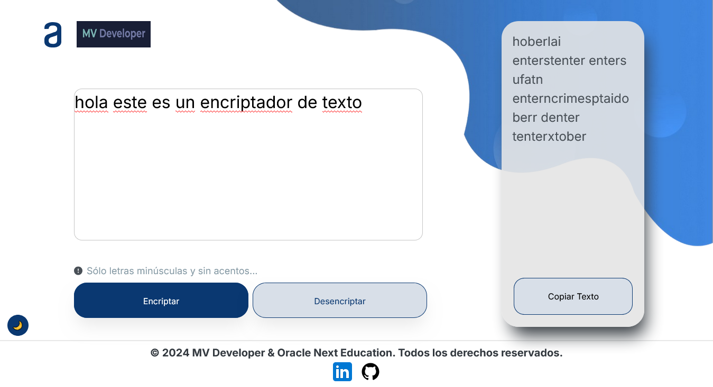
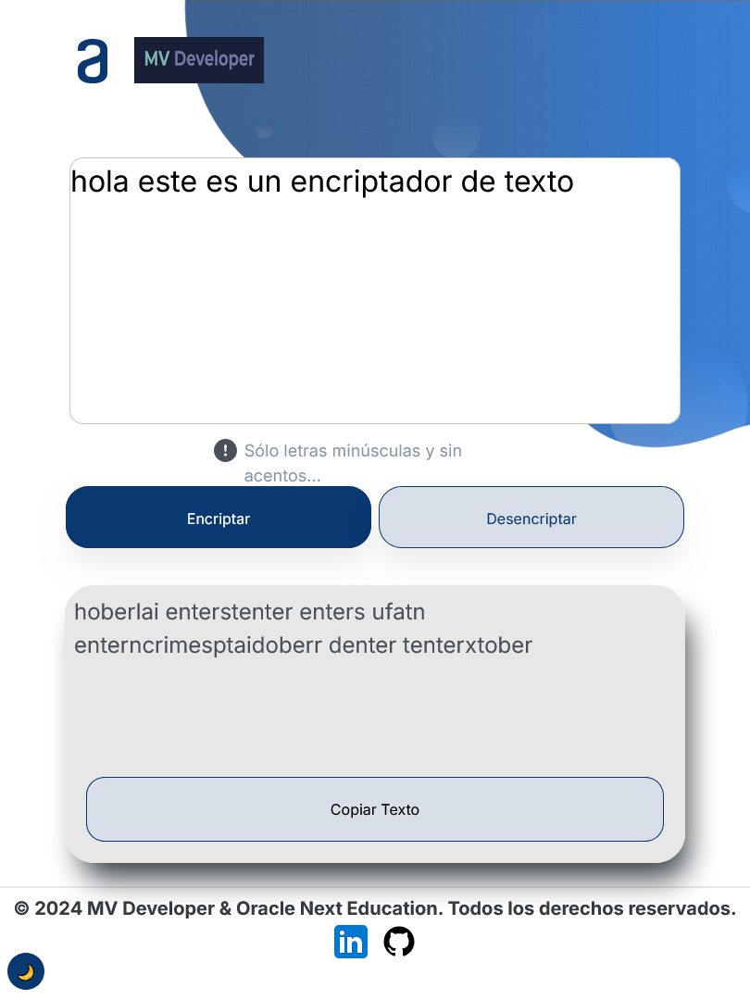
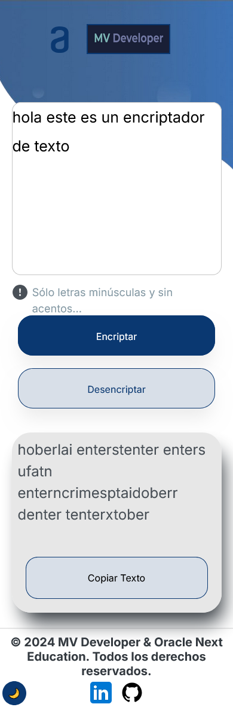

# ORACLE NEXT EDUCATION - DESAFÍO: ENCRIPTADOR DE TEXTO.

Como parte de la ruta "Principiante en Programación" del Programa ONE de Oracle y Alura Latinoamérica se realiza este desafío que consiste en un encriptador de texto, utilizando JavaScript, HTML y CSS.

El encriptador consiste en un text area el cuál recibe un texto en minúsculas, dos botones de encriptar y desencriptar y una sección que recibe el texto encriptado con un botón de copiar texto.

Versión para escritorio:

Versión para tableta:

Versión para móvil:

El diseño se basa en el propuesto por Alura publicando en Figma.

Para el correcto funcionamiento se marcaron algunas pautas importantes:

  *El texto que se recibe debe ser totalmente en minúsculas,
  *no debe tener acentos,
  *no debe tener caractéres especiales.

Una vez encriptado el texto también es posible convertir esta palabra a su versión original.

El encriptado del texto se basa en las siguientes llaves:

 *La letra "e" es convertida para "enter",
 *la letra "i" es convertida para "imes",
 *la letra "a" es convertida para "ai",
 *la letra "o" es convertida para "ober",
 *la letra "u" es convertida para "ufat.

La funcionalidad del encriptador se basa principalmente en la delegación de eventos en los botones de encriptar y desencriptar, así como el uso de expresiones regulares para el reemplazo de acentos y carácteres especiales.

Considerando la adaptabilidad a otros dispositivos, se hizo un proyecto responsivo, adaptándolo principalmente a tablet y smartphone.

## Herramientas utilizadas:

 

 

